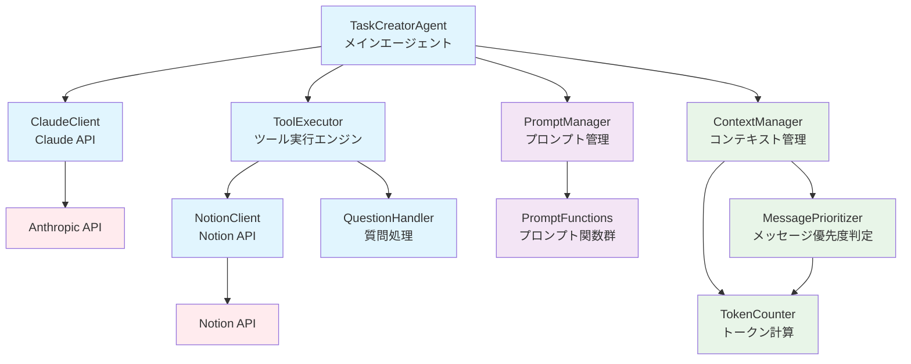
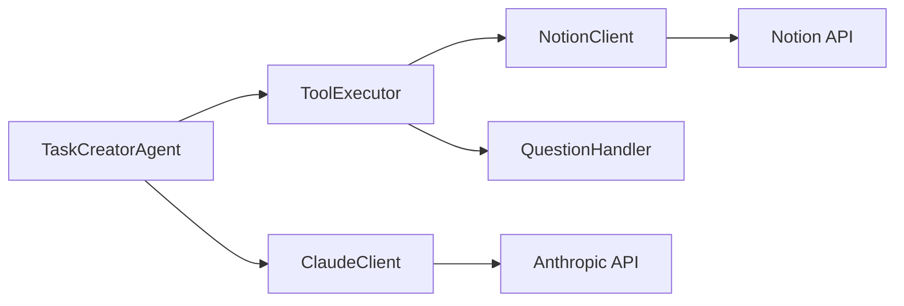
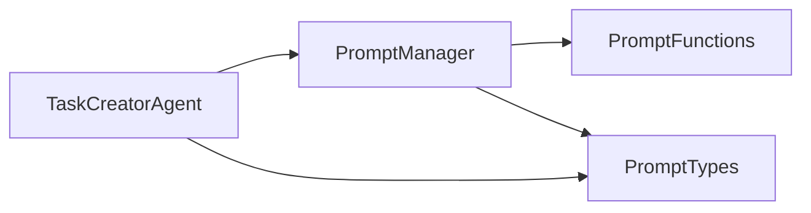
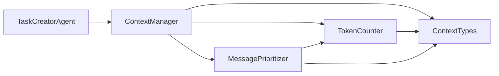
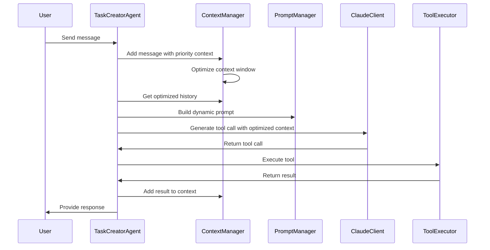
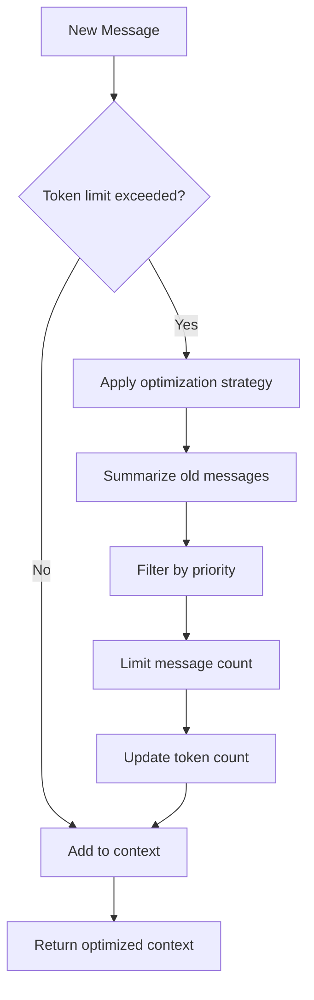
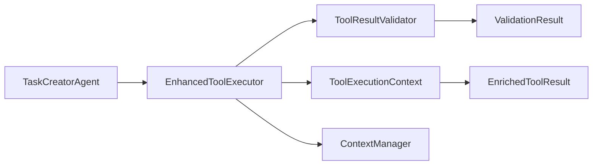

# 🏗️ Architecture Documentation

This document describes the architecture of the Shochan AI Agent, implemented following the [12-factor agents](https://github.com/humanlayer/12-factor-agents) principles.

## 📊 Overall Architecture



## 🎯 Layered Architecture

### **Agent Layer**
- **TaskCreatorAgent**: Main orchestrator implementing 12-factor principles

### **Service Layer**
- **ContextManager** (Factor 3): Strategic context window management
- **PromptManager** (Factor 2): Dynamic prompt selection and management
- **ToolExecutor** (Factor 1): Tool execution engine

### **Client Layer**
- **ClaudeClient**: Anthropic Claude API integration
- **NotionClient**: Notion API integration for GTD system
- **QuestionHandler**: Interactive user questioning


## 📚 Factor-by-Factor Implementation

### **Factor 1: Natural Language to Tool Calls** ✅

**Purpose**: Convert natural language input into structured tool calls



**Components**:
- `ClaudeClient`: Handles LLM API communication
- `ToolExecutor`: Manages tool execution lifecycle
- `NotionClient`: Creates tasks and projects in Notion
- `QuestionHandler`: Interactive user questioning

### **Factor 2: Own Your Prompts** ✅

**Purpose**: Take ownership of prompt engineering with dynamic prompt management



**Components**:
- `PromptManager`: Central prompt orchestration
- `PromptFunctions`: Stage-specific prompt generation
- `PromptTypes`: Type-safe prompt context definitions

**Conversation Stages**:
1. `initial`: Handling ambiguous user requests
2. `gathering_info`: Efficient information collection
3. `confirming`: Pre-creation confirmation
4. `executing`: Actual task/project creation

### **Factor 3: Own Your Context Window** ✅

**Purpose**: Strategic context window management for token efficiency



**Components**:
- `ContextManager`: Strategic context optimization
- `TokenCounter`: Accurate token calculation
- `MessagePrioritizer`: Intelligent message priority assessment
- `ContextTypes`: Type definitions for context management

**Key Features**:
- **Automatic Summarization**: Rolling summary of conversation history
- **Priority-Based Filtering**: Keep only important messages
- **Token Optimization**: 30-60% token savings
- **Real-time Statistics**: Context window utilization tracking

## 🎨 Design Patterns

### **1. Dependency Injection**
```typescript
constructor() {
  this.claude = new ClaudeClient();
  this.toolExecutor = new ToolExecutor();
  this.promptManager = new PromptManager();
  this.contextManager = new ContextManager(); // Factor 3
}
```

### **2. Strategy Pattern (Factor 3)**
```typescript
new ContextManager({
  enableSummarization: true,
  summaryThreshold: 8,
  priorityThreshold: 'medium',
  maxHistoryMessages: 15,
  tokenBudgetRatio: 0.7,
});
```

### **3. Type Guards for Runtime Safety**
```typescript
if (isCreateTaskTool(toolCall)) {
  // Type-safe tool execution
}
```

### **4. Factory Pattern (Factor 2)**
```typescript
// Dynamic prompt selection based on conversation stage
const promptFunction = this.selectPromptFunction(context);
const systemPrompt = promptFunction.build(context);
```

## 📁 File Structure

```
src/
├── agents/
│   └── task-creator.ts           # Main agent orchestrator
├── clients/
│   ├── claude.ts                 # Anthropic Claude API client
│   └── notion.ts                 # Notion API client
├── context/                      # Factor 3: Context Management
│   ├── context-manager.ts        # Strategic context optimization
│   ├── message-prioritizer.ts    # Message priority assessment
│   └── token-counter.ts          # Token calculation utilities
├── prompts/                      # Factor 2: Prompt Management
│   ├── prompt-functions.ts       # Dynamic prompt functions
│   ├── prompt-manager.ts         # Prompt orchestration
│   └── system.ts                 # Legacy static prompts
├── tools/                        # Factor 1 & 4: Tool System
│   ├── index.ts                  # Legacy tool execution engine
│   ├── enhanced-tool-executor.ts # Factor 4: Enhanced execution with validation
│   ├── tool-execution-context.ts # Factor 4: Execution context management
│   ├── tool-result-validator.ts  # Factor 4: Input/output validation
│   └── question-handler.ts       # Interactive questioning
├── types/
│   ├── context-types.ts          # Context management types
│   ├── prompt-types.ts           # Prompt system types
│   ├── tools.ts                  # Tool system types
│   └── toolGuards.ts            # Runtime type validation
├── utils/
│   └── notionUtils.ts           # Notion utility functions
└── test-*.ts                    # Various test scenarios
```

## 🔄 Data Flow

### **1. Message Processing Flow**


### **2. Context Optimization Process**


## 🚀 Performance Optimizations

### **Factor 3 Benefits**
- **30-60% token savings** through strategic context management
- **Improved response accuracy** by maintaining relevant context
- **Scalable conversation handling** through automatic summarization
- **Real-time optimization** with minimal performance overhead

### **Memory Efficiency**
- Single source of truth for conversation history (ContextManager)
- Automatic cleanup of low-priority messages
- Structured state encoding for compact representation

### **Factor 4: Tools are Just Structured Outputs** ✅

**Purpose**: Enhanced tool execution with structured outputs, validation, and monitoring



**Components**:
- `EnhancedToolExecutor`: Decorator pattern over legacy ToolExecutor
- `ToolResultValidator`: Type-safe input/output validation
- `ToolExecutionContext`: Rich execution context with tracing
- `EnrichedToolResult`: Structured results with metadata

**Key Features**:
- **Tool-specific timeouts**: ask_question (10min), API calls (30s)
- **Input/Output validation**: Type guards without `as` casting
- **Distributed tracing**: TraceID for multi-tool conversations
- **Performance monitoring**: Execution time, retry counts, statistics
- **Error handling**: Structured errors with suggested actions

## 🔮 Future Architecture (Factors 5-12)

### **Next Priorities**
1. **Factor 5**: Unify Execution State with Business State
2. **Factor 6**: Agent Interaction APIs
3. **Factor 7**: Agents are Async Everywhere

### **Planned Architectural Enhancements**
- **Microservices Architecture**: Small, focused agents (Factor 10)
- **Event-Driven Design**: Triggerable from anywhere (Factor 11)
- **Stateless Reducers**: Pure function-based agents (Factor 12)

## 🛠️ Development Guidelines

### **Adding New Factors**
1. Create dedicated directory under `src/`
2. Define types in `src/types/`
3. Implement core logic with dependency injection
4. Integrate with `TaskCreatorAgent`
5. Add tests and documentation

### **Type Safety**
- Use strict TypeScript configuration
- Implement runtime type guards
- Define clear interfaces for all components

### **Testing Strategy**
- Unit tests for individual components
- Integration tests for factor combinations
- Interactive tests for user experience validation

---

This architecture demonstrates the progressive implementation of 12-factor agents principles, creating a robust, scalable, and maintainable AI agent system.