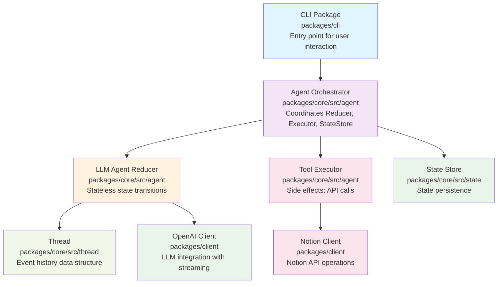
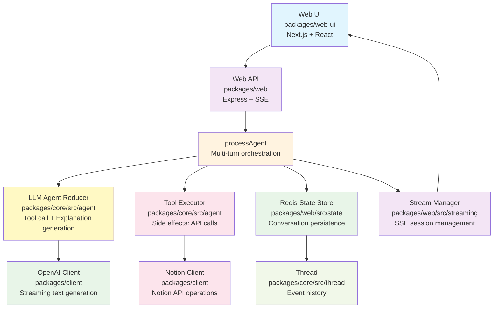
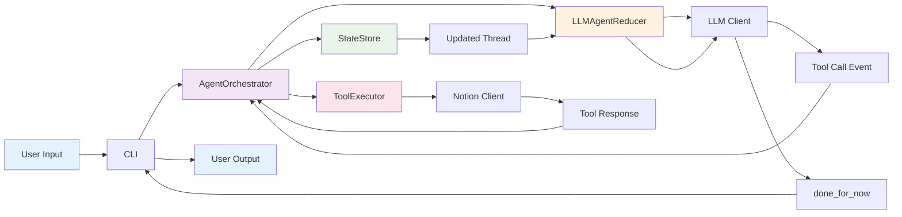
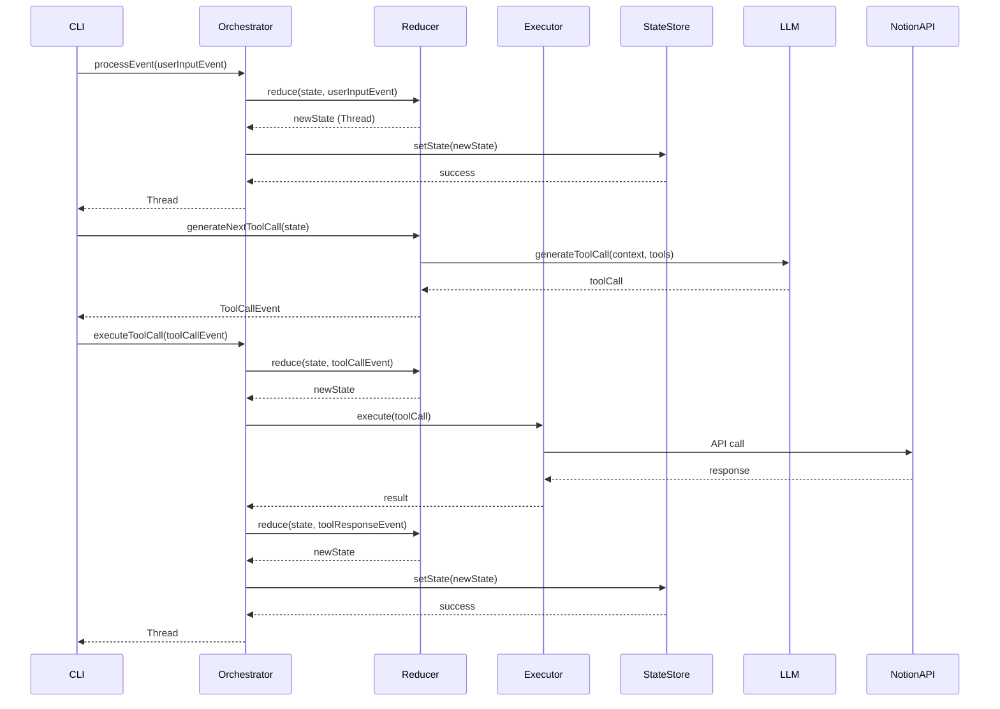
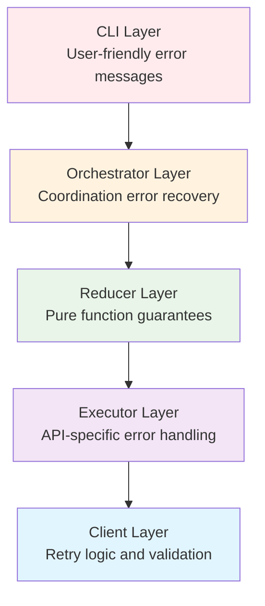
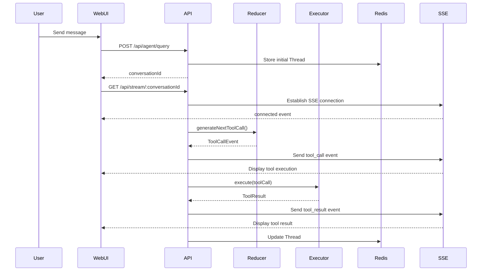
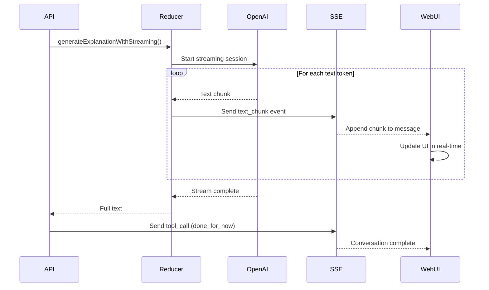

# Architecture Documentation

## Overview

Shochan AI is built as a conversational AI agent that bridges natural language requests with structured operations on external systems (Notion databases). The architecture follows the **Stateless Reducer Pattern**, prioritizing type safety, maintainability, scalability, and extensibility.

The project is structured as a **monorepo** using pnpm workspaces to enable code sharing and modular development.

## Monorepo Structure

```
shochan_ai/
├── packages/
│   ├── core/              # Business logic
│   │   ├── src/
│   │   │   ├── agent/     # Stateless Reducer, Orchestrator, Executors
│   │   │   ├── thread/    # Conversation state management
│   │   │   ├── state/     # State persistence interfaces
│   │   │   ├── types/     # Type definitions and Zod schemas
│   │   │   ├── utils/     # Utility functions
│   │   │   └── prompts/   # System prompts
│   │   └── package.json
│   │
│   ├── client/            # API clients (depends on core)
│   │   ├── src/
│   │   │   ├── openai.ts           # OpenAI client with streaming support
│   │   │   ├── openai-streaming.ts # OpenAI streaming type definitions
│   │   │   └── notion.ts           # Notion client
│   │   └── package.json
│   │
│   ├── cli/               # CLI implementation (depends on core + client)
│   │   ├── src/
│   │   │   ├── index.ts   # CLI entry point
│   │   │   └── agent/     # CLI-specific agent configuration
│   │   └── package.json
│   │
│   ├── web/               # Web API server (depends on core + client)
│   │   ├── src/
│   │   │   ├── server.ts           # Server initialization
│   │   │   ├── app.ts              # Express app configuration
│   │   │   ├── routes/             # API endpoints (agent, stream)
│   │   │   ├── state/              # Redis state persistence
│   │   │   ├── streaming/          # SSE session management
│   │   │   └── middleware/         # Error and fallback handlers
│   │   └── package.json
│   │
│   └── web-ui/            # Next.js frontend (depends on core for types)
│       ├── app/           # Next.js App Router
│       ├── components/    # React components (chat, ui)
│       ├── hooks/         # Custom hooks (useSSE, etc.)
│       ├── lib/           # API clients and utilities
│       ├── types/         # Frontend-specific types
│       └── package.json
│
├── docs/                  # Documentation
│   ├── ARCHITECTURE.md    # This file
│   └── streaming-implementation-plan.md  # Streaming feature implementation
├── pnpm-workspace.yaml    # Workspace configuration
├── tsconfig.base.json     # Shared TypeScript config
└── package.json           # Root package with scripts
```

**Dependency Graph:**
```
packages/core
    ↑
    ├── packages/client (depends on @shochan_ai/core)
    │       ↑
    │       ├── packages/cli (depends on @shochan_ai/core + @shochan_ai/client)
    │       └── packages/web (depends on @shochan_ai/core + @shochan_ai/client)
    │
    └── packages/web-ui (depends on @shochan_ai/core for types only)
```

## High-Level Architecture

### CLI Architecture



### Web Architecture



## Core Architecture Principles

### 1. Stateless Reducer Pattern

The architecture follows the **Stateless Reducer Pattern** where all state transitions are pure functions:

```typescript
(state, event) → newState
```

**Key Principles:**
- **Pure Functions**: No side effects in state transitions
- **Explicit State**: All state is passed explicitly, no hidden internal state
- **Reproducibility**: Every state transition is deterministic and traceable
- **Scalability**: State can be persisted and resumed on any server

### 2. Separation of Concerns

The architecture separates three key responsibilities:

1. **AgentReducer**: Pure state transitions (no side effects)
2. **ToolExecutor**: Side effects (API calls, I/O operations)
3. **AgentOrchestrator**: Coordination between Reducer, Executor, and StateStore

### 3. Type Safety

- **Zod Schemas**: Tool calls use zod for schema definition and runtime validation
- **Discriminated Unions**: All events and tool calls use TypeScript discriminated unions
- **No `any`**: Strict type checking throughout the codebase
- **Runtime Validation**: Zod validation at API boundaries, type guards for internal checks
- **Single Source of Truth**: Types are inferred from zod schemas (`type ToolCall = z.infer<typeof toolCallSchema>`)

## Core Components

### 1. CLI Interface (`packages/cli/src/index.ts`)

The command-line interface serves as the entry point for user interactions.

**Location:** `packages/cli/src/index.ts`

**Responsibilities:**
- Parse command-line arguments
- Initialize AgentOrchestrator with components
- Handle conversational loops for multi-turn interactions
- Manage user input/output for interactive sessions
- Implement CLI-specific business logic (approval flows, user prompts)

**Key Features:**
- Single-command execution mode
- Interactive conversation handling via recursion
- Approval flow for destructive operations (e.g., delete_task)
- Graceful error handling and process management
- Shebang support for direct execution (`#!/usr/bin/env node`)

**Package Configuration:**
```json
{
  "name": "@shochan_ai/cli",
  "bin": {
    "shochan-ai": "./dist/index.js"
  },
  "dependencies": {
    "@shochan_ai/core": "workspace:*",
    "@shochan_ai/client": "workspace:*"
  }
}
```

**Agent Loop Implementation:**
```typescript
// Add user input to thread
let currentThread = await orchestrator.processEvent(userInputEvent);

// Agent loop: LLM → Tool Execution → LLM
while (true) {
  // Generate next tool call via LLM
  const toolCallEvent = await reducer.generateNextToolCall(currentThread);

  if (!toolCallEvent) break;

  // CLI-specific logic: approval, termination, user input
  if (toolCall.intent === 'delete_task') {
    // Ask for approval
  }
  if (toolCall.intent === 'done_for_now') {
    // Display message and exit
  }
  if (toolCall.intent === 'request_more_information') {
    // Ask user and recurse
  }

  // Execute tool call
  currentThread = await orchestrator.executeToolCall(toolCallEvent);
}
```

### 2. Agent Orchestrator (`packages/core/src/agent/agent-orchestrator.ts`)

The central coordinator that manages the interaction between Reducer, Executor, and StateStore.

**Location:** `packages/core/src/agent/agent-orchestrator.ts`

**Package:** `@shochan_ai/core`

**Responsibilities:**
- Coordinate Reducer for state transitions
- Coordinate Executor for tool execution
- Manage state persistence via StateStore
- Provide clean API for event processing

**Core Methods:**
```typescript
class AgentOrchestrator {
  // Process an event (user input, etc.) through the reducer
  async processEvent(event: Event): Promise<Thread>

  // Execute a tool call via the executor
  async executeToolCall(toolCallEvent: ToolCallEvent): Promise<Thread>

  // Get current state
  getState(): Thread
}
```

**Design Pattern:**
The Orchestrator implements the **Mediator Pattern**, decoupling the Reducer, Executor, and StateStore from each other.

### 3. LLM Agent Reducer (`packages/core/src/agent/llm-agent-reducer.ts`)

Generic AgentReducer implementation that uses an LLM to determine next tool calls.

**Location:** `packages/core/src/agent/llm-agent-reducer.ts`

**Package:** `@shochan_ai/core`

**Responsibilities:**
- Implement pure state transitions (add events to thread)
- Generate next tool call via LLM
- Abstract LLM client interface for flexibility (OpenAI, Anthropic, etc.)

**Generic Type Constraints:**
```typescript
class LLMAgentReducer<
  TLLMClient extends {
    generateToolCall(params: {
      systemPrompt: string;
      inputMessages: Array<unknown>;
      tools?: Array<unknown>;
    }): Promise<{ toolCall: unknown | null }>;
    generateToolCallWithStreaming?(params: {
      systemPrompt: string;
      inputMessages: Array<unknown>;
      tools?: Array<unknown>;
      onToolCall?: (toolCall: unknown) => void;
      onTextChunk?: (chunk: string, messageId: string) => void;
    }): Promise<{ toolCall: unknown | null }>;
    generateTextWithStreaming?(params: {
      systemPrompt: string;
      inputMessages: Array<unknown>;
      onTextChunk?: (chunk: string, messageId: string) => void;
    }): Promise<string>;
  },
  TTools extends Array<unknown>
> implements AgentReducer<Thread, Event>
```

**Core Methods:**
```typescript
// Pure function: add event to thread state
reduce(state: Thread, event: Event): Thread

// Async LLM call: generate next tool call (non-streaming)
async generateNextToolCall(state: Thread): Promise<ToolCallEvent | null>

// Async LLM call: generate next tool call with streaming (optional)
async generateNextToolCallWithStreaming(
  state: Thread,
  onToolCall?: (toolCall: ToolCall) => void,
  onTextChunk?: (chunk: string, messageId: string) => void
): Promise<ToolCallEvent | null>

// Async LLM call: generate explanation with streaming (optional)
async generateExplanationWithStreaming(
  state: Thread,
  onTextChunk?: (chunk: string, messageId: string) => void
): Promise<string>
```

### 4. Tool Executor (`packages/core/src/agent/tool-executor.ts`)

Interface for executing tools with side effects.

**Location:** `packages/core/src/agent/tool-executor.ts`

**Package:** `@shochan_ai/core`

**Responsibilities:**
- Define interface for tool execution
- Abstract side effects (API calls, I/O) from pure state transitions

**Interface:**
```typescript
interface ToolExecutor {
  execute(toolCall: ToolCall): Promise<ToolExecutionResult>;
}

type ToolExecutionResult = {
  event: Event;  // Returns tool_response or error event
};
```

**Implementation:** `NotionToolExecutor` (`packages/core/src/agent/notion-tool-executor.ts`)

**Supported Tools:**
- `get_tasks`: Retrieve tasks from Notion with filtering options
- `get_task_details`: Get detailed information about a specific task
- `create_task`: Create new tasks in Notion GTD system
- `update_task`: Modify existing tasks
- `delete_task`: Remove tasks (requires approval in CLI)
- `create_project`: Create new projects with importance levels
- `request_more_information`: Ask user for clarification (no API call)
- `done_for_now`: Provide final response to user (no API call)

### 5. Thread Management (`packages/core/src/thread/thread.ts`)

Immutable data structure for conversation state.

**Location:** `packages/core/src/thread/thread.ts`

**Package:** `@shochan_ai/core`

**Responsibilities:**
- Store conversation events in chronological order (immutable)
- Serialize conversation context for LLM consumption
- Provide recursive object serialization for complex data structures

**Immutability:**
```typescript
class Thread {
  readonly events: readonly Event[];  // Immutable event history
  
  constructor(events: readonly Event[]) {
    this.events = [...events];  // Defensive copy
  }
}
```

**Event Structure:**
```typescript
type Event =
  | { type: 'user_input'; timestamp: number; data: string }
  | { type: 'tool_call'; timestamp: number; data: ToolCall }
  | { type: 'tool_response'; timestamp: number; data: unknown }
  | { type: 'error'; timestamp: number; data: { error: string; code?: string } }
  | { type: 'complete'; timestamp: number; data: unknown }
  | { type: 'awaiting_approval'; timestamp: number; data: ToolCall }
  | { type: 'text_chunk'; timestamp: number; data: { content: string; messageId: string } }
  | { type: 'connected'; timestamp: number; data: { status: string; conversationId: string } };
```

**Streaming Events:**
- **text_chunk**: Real-time text tokens from LLM streaming
  - `content`: Text chunk to append
  - `messageId`: Unique identifier for grouping chunks into messages
- **connected**: SSE connection confirmation
  - `status`: Connection status ("ready")
  - `conversationId`: Unique conversation identifier

**Serialization Features:**
- XML-based context serialization for LLM
- Recursive handling of nested objects and arrays
- Intelligent filtering of internal fields (e.g., 'intent')

**Example Serialization:**
```xml
<user_input>
今週のタスクを10件教えて
</user_input>

<get_tasks>
limit: 10
task_type: Today
</get_tasks>

<tool_response>
tasks: [
  {title: "レポート作成", scheduled_date: "2025-01-24"},
  {title: "会議準備", scheduled_date: "2025-01-25"}
]
</tool_response>
```

### 6. State Store (`packages/core/src/state/state-store.ts`)

Interface for state persistence with multiple implementations.

**Location:** `packages/core/src/state/state-store.ts`

**Package:** `@shochan_ai/core`

**Interface:**
```typescript
interface StateStore<TState = Thread> {
  getState(): TState;
  setState(state: TState): void;
}
```

**Implementations:**
- **InMemoryStateStore** (`packages/core/src/state/in-memory-state-store.ts`): For CLI
- **RedisStateStore** (planned for Web): For production web deployment

### 7. External Clients

#### OpenAI Client (`packages/client/src/openai.ts`)

Handles integration with OpenAI's API via Responses API with streaming support.

**Location:** `packages/client/src/openai.ts`

**Package:** `@shochan_ai/client` (depends on `@shochan_ai/core`)

**Responsibilities:**
- Generate structured function calls from natural language using GPT-4o
- Stream text generation in real-time for natural user experience
- Manage API communication with retry logic
- Handle rate limiting and error recovery

**Features:**
- **OpenAI Responses API**: Server-side conversation management
- **Streaming Support**: Real-time text token streaming via callbacks
  - `generateToolCallWithStreaming()`: Stream tool call generation
  - `generateTextWithStreaming()`: Stream explanation text
- **Type Safety**: TypeScript type guards for runtime event validation
- **Automatic JSON Parsing**: Function arguments parsing
- **Retry Mechanism**: 3 attempts with exponential backoff
- **Function Calling**: Support for 8 tools
- **Cost Optimization**: Server-side conversation caching
- **Error Handling**: Comprehensive error catching and reporting

**Streaming Implementation:**
```typescript
// Type guards for OpenAI streaming events
function isResponseFunctionCallEvent(event: unknown): boolean
function isResponseTextDeltaEvent(event: unknown): boolean

// Streaming methods
async generateToolCallWithStreaming(params: {
  systemPrompt: string;
  inputMessages: InputMessage[];
  tools: Array<unknown>;
  onToolCall?: (toolCall: ToolCall) => void;
  onTextChunk?: (chunk: string, messageId: string) => void;
}): Promise<{ toolCall: ToolCall | null }>

async generateTextWithStreaming(params: {
  systemPrompt: string;
  inputMessages: InputMessage[];
  onTextChunk?: (chunk: string, messageId: string) => void;
}): Promise<string>
```

#### Notion Client (`packages/client/src/notion.ts`)

Manages all interactions with Notion databases.

**Location:** `packages/client/src/notion.ts`

**Package:** `@shochan_ai/client` (depends on `@shochan_ai/core`)

**Responsibilities:**
- CRUD operations on tasks and projects
- Database querying with filtering and sorting
- Data transformation between internal and Notion formats

**Supported Operations:**
- Task creation with GTD categorization
- Task retrieval with advanced filtering options
- Task detail retrieval including page content
- Task updating (title, type, scheduled date, project, archive status)
- Task deletion with archival
- Project creation with importance levels
- Proper error handling and validation

### 8. Type System (`packages/core/src/types/`)

Comprehensive type definitions ensuring type safety across the application using **zod schemas as the single source of truth**.

**Location:** `packages/core/src/types/`

**Package:** `@shochan_ai/core`

**Key Type Categories:**
- **Event Types**: Discriminated union of all event types
- **Tool Types**: Zod schemas with inferred TypeScript types
- **Notion Types**: Database schema and API response types
- **Task Types**: GTD system task categorizations
- **Tool Guards**: Runtime type validation functions

**Type Safety Features:**
- **Single Source of Truth**: Types are inferred from zod schemas
- Strict TypeScript configuration
- Runtime validation via zod at API boundaries
- Discriminated unions for events and tool calls
- No use of `any` type

**Zod Schema-Based Types (Single Source of Truth):**
```typescript
import { z } from 'zod';

// Define schema once
export const createTaskSchema = z.object({
  intent: z.literal('create_task'),
  parameters: z.object({
    title: z.string(),
    description: z.string(),
    task_type: taskTypeSchema,
    scheduled_date: z.string().optional(),
    project_id: z.string().optional(),
  }),
});

// Discriminated union schema
export const toolCallSchema = z.discriminatedUnion('intent', [
  createTaskSchema,
  createProjectSchema,
  getTasksSchema,
  // ... other tool schemas
]);

// Type inferred from schema (no manual type definition needed)
export type ToolCall = z.infer<typeof toolCallSchema>;
export type CreateTaskTool = z.infer<typeof createTaskSchema>;
```

### 9. Utilities (`packages/core/src/utils/`)

Supporting utilities for data processing and API interactions.

**Location:** `packages/core/src/utils/`

**Package:** `@shochan_ai/core`

**Components:**
- **Notion Query Builder**: Constructs complex database queries with filtering and sorting
- **Notion Task Parser**: Transforms Notion responses to internal format, includes block content parsing
- **Notion Utils**: Helper functions for API parameter construction and page updates

## Data Flow

### 1. Request Processing Flow



### 2. State Transition Flow



### 3. Conversation State Management

The system maintains conversation state through an event-driven model:

1. **User Input Events**: Capture user requests and responses
2. **Tool Call Events**: Record LLM decisions and tool invocations
3. **Tool Response Events**: Store external system responses
4. **Error Events**: Track errors and failures
5. **Complete Events**: Mark conversation completion

**Immutability:**
Every state transition creates a new `Thread` instance. The original state is never mutated.

```typescript
// Pure state transition
reduce(state: Thread, event: Event): Thread {
  return new Thread([...state.events, event]);
}
```

## Design Patterns

### 1. Stateless Reducer Pattern

**Implementation:**
```typescript
interface AgentReducer<TState, TEvent> {
  reduce(state: TState, event: TEvent): TState;
}
```

**Benefits:**
- Horizontal scalability (state can be persisted and resumed anywhere)
- Debuggability (state transitions are traceable)
- Testability (pure functions are easy to test)
- Time-travel debugging (state snapshots enable replay)

### 2. Mediator Pattern (Orchestrator)

The `AgentOrchestrator` mediates between:
- **Reducer**: State transitions
- **Executor**: Side effects
- **StateStore**: Persistence

**Benefits:**
- Decoupling of components
- Single point of coordination
- Easy to swap implementations

### 3. Strategy Pattern

The system uses strategy pattern for:
- **Tool Execution Strategies**: Different handling for different tool types
- **State Persistence Strategies**: InMemoryStateStore vs RedisStateStore
- **LLM Client Strategies**: OpenAI, Anthropic, or custom LLM clients

### 4. Command Pattern

Tool calls implement the command pattern:
- **Command Interface**: `ToolCall` discriminated union
- **Concrete Commands**: `CreateTaskTool`, `GetTasksTool`, etc.
- **Invoker**: `AgentOrchestrator` orchestrates execution
- **Receiver**: `NotionToolExecutor` executes actual operations

## Configuration Management

### Environment Variables

```env
OPENAI_API_KEY             # OpenAI API access
NOTION_API_KEY             # Notion integration token
NOTION_TASKS_DATABASE_ID   # Tasks database identifier
NOTION_PROJECTS_DATABASE_ID # Projects database identifier
```

### System Configuration

- **OpenAI Model**: gpt-4o (GPT-4 Optimized)
- **Max Tokens**: 1024 for function call generation
- **Retry Policy**: 3 attempts with exponential backoff
- **Default Limits**: 10 tasks per query, configurable up to 100
- **API Type**: OpenAI Responses API with server-side conversation storage

## Error Handling Strategy

### 1. Layered Error Handling



### 2. Error Types

- **Configuration Errors**: Missing environment variables
- **API Errors**: External service failures with retry logic
- **Validation Errors**: Invalid tool parameters or data structures
- **Business Logic Errors**: GTD system constraint violations

### 3. Recovery Mechanisms

- **Automatic Retry**: For transient API failures (Executor layer)
- **Error Events**: Errors are added to thread as events
- **Graceful Degradation**: Partial functionality when services are limited
- **User Feedback**: Clear error messages with suggested actions

## Performance Considerations

### 1. Stateless Design Benefits

- **No Server Affinity**: Requests can be handled by any server
- **Easy Scaling**: State can be persisted to Redis and resumed anywhere
- **Replay Capability**: State snapshots enable debugging and recovery

### 2. Memory Management

- **Conversation History**: Grows linearly with interaction length
- **Object Serialization**: Recursive but bounded by conversation depth
- **State Persistence**: Can be moved to external store (Redis) for production

### 3. Scalability Factors

- **Stateless Design**: Supports horizontal scaling
- **Pluggable StateStore**: InMemory for CLI, Redis for Web
- **Resource Usage**: Bounded by conversation length and tool complexity

## Security Considerations

### 1. API Key Management

- Environment variable storage only
- No key logging or persistence
- Secure client initialization patterns

### 2. Data Privacy

- State can be persisted (CLI: memory, Web: Redis)
- Notion data access limited to configured databases
- User data never logged or transmitted beyond necessary APIs

### 3. Input Validation

- Runtime validation of LLM responses using zod schemas
- `ToolCallValidationError` provides detailed error messages for invalid tool calls
- Comprehensive type checking at API boundaries
- Sanitization of user inputs before external API calls

## Testing Strategy

### 1. Unit Testing

- Individual component testing with Vitest
- Mock external dependencies (OpenAI, Notion APIs) using Test Doubles
- Type guard validation testing
- Utility function testing

**Test Approach:**
- **Classical Testing**: Test real business logic with Test Doubles
- **Pure Function Testing**: Reducer tests are deterministic
- **Mock Verification**: Use `vi.fn()` to verify interactions

### 2. Integration Testing

- End-to-end CLI testing scenarios
- API client integration verification
- Error handling pathway testing

### 3. Type Testing

- TypeScript strict mode enforcement
- Runtime type validation testing
- Tool call structure validation

## Deployment & Operations

### 1. Build Process

**Monorepo Build Commands:**
```bash
# Build all packages
pnpm build          # Builds packages/core, packages/client, packages/cli

# Build specific package
pnpm --filter @shochan_ai/core build
pnpm --filter @shochan_ai/client build
pnpm --filter @shochan_ai/cli build

# Run CLI
pnpm cli "your message here"

# Testing
pnpm test           # Run all tests (vitest)
pnpm test:watch     # Watch mode

# Code Quality
pnpm check          # Biome linting and formatting
pnpm check:fix      # Auto-fix issues
```

**Build Order:**
TypeScript project references ensure correct build order:
1. `packages/core`
2. `packages/client` (depends on core)
3. `packages/cli` (depends on core + client)

### 2. Runtime Requirements

- Node.js 18+ environment
- pnpm 8+ (for workspace support)
- Environment variable configuration (`.env` in repository root)
- Network access to OpenAI and Notion APIs

**Environment Variables:**
The CLI automatically loads `.env` from the repository root:
```typescript
// packages/cli/src/index.ts
dotenv.config({ path: path.resolve(__dirname, '../../..', '.env') });
```

### 3. Monitoring

- Console-based logging for development
- Error tracking through CLI exit codes
- StateStore enables conversation replay for debugging

## Web UI and Streaming Architecture

### Overview

The web architecture extends the core Stateless Reducer Pattern with real-time streaming capabilities, enabling users to see LLM responses as they're generated. The system uses a **multi-turn conversation approach** that separates tool execution from text generation for optimal user experience.

### Web Components

#### 1. Web API Server (`packages/web`)

Express-based API server with SSE streaming support.

**Key Components:**
- **Agent Router** (`src/routes/agent.ts`): Query submission and approval endpoints
- **Stream Router** (`src/routes/stream.ts`): SSE connection management
- **Redis State Store** (`src/state/redis-store.ts`): Thread persistence with 1-hour TTL
- **Stream Manager** (`src/streaming/manager.ts`): SSE session management

**API Endpoints:**
- `POST /api/agent/query`: Submit new query, returns `conversationId`
- `GET /api/stream/:conversationId`: SSE connection for real-time events
- `POST /api/agent/approve/:conversationId`: Approve/deny pending tool calls
- `GET /health`: Health check endpoint

#### 2. Web UI (`packages/web-ui`)

Next.js-based frontend with real-time chat interface.

**Key Components:**
- **ChatInterface** (`components/chat/chat-interface.tsx`): Main chat UI with SSE integration
- **SSE Client** (`lib/sse-client.ts`): Server-Sent Events connection management
- **useSSE Hook** (`hooks/use-sse.ts`): React hook for SSE lifecycle
- **useSendMessage Hook** (`lib/api/hooks/use-send-message.ts`): API call hook

**Features:**
- Real-time text streaming display
- Event type visualization (badges for tool calls, approvals, etc.)
- Auto-scroll to latest message
- Error handling and display
- Responsive design with Tailwind CSS

### Multi-turn Conversation Flow

The web implementation uses a **two-turn approach** for optimal user experience:

#### Turn 1: Tool Call Detection and Execution (Non-streaming)



#### Turn 2: Explanation Generation (Streaming)



### SSE Connection Management

#### Dynamic Polling

The system uses dynamic polling to wait for SSE connection establishment:

```typescript
async function waitForSSEConnection(
  conversationId: string,
  streamManager: StreamManager,
  timeout: number = 2000
): Promise<boolean> {
  const startTime = Date.now();
  
  while (Date.now() - startTime < timeout) {
    if (streamManager.hasSession(conversationId)) {
      return true;
    }
    await new Promise(resolve => setTimeout(resolve, 100));
  }
  
  return false; // Timeout
}
```

**Benefits:**
- Faster processing when connection is quick (100ms vs fixed 500ms)
- More reliable connection confirmation
- Timeout handling with warning logs
- Improved observability

#### Stream Manager

Manages active SSE sessions with in-memory storage:

```typescript
class StreamManager {
  register(conversationId: string, session: SSESession): void
  send(conversationId: string, event: Event): void
  unregister(conversationId: string): void
  hasSession(conversationId: string): boolean
  getActiveSessionCount(): number
  closeAll(): void
}
```

**Features:**
- Session lifecycle management
- Event broadcasting to specific conversations
- Auto-cleanup on connection close
- Graceful shutdown support

### State Persistence with Redis

#### Redis State Store

Persists Thread state for horizontal scaling:

```typescript
class RedisStateStore implements StateStore<Thread> {
  async connect(): Promise<void>
  async disconnect(): Promise<void>
  async get(conversationId: string): Promise<Thread | null>
  async set(conversationId: string, thread: Thread): Promise<void>
  async delete(conversationId: string): Promise<void>
  async clear(): Promise<void>
  async list(): Promise<string[]>
}
```

**Configuration:**
- **Key Pattern**: `shochan_ai:conversation:{conversationId}`
- **TTL**: 3600 seconds (1 hour)
- **Storage Format**: JSON-serialized Thread

**Benefits:**
- Horizontal scaling: Any server can handle any request
- Conversation persistence across server restarts
- Automatic cleanup via TTL
- Support for pause/resume workflows

### Error Handling

#### Comprehensive Error Coverage

The streaming implementation includes robust error handling at all layers:

**LLMAgentReducer Layer:**
```typescript
async generateExplanationWithStreaming(
  state: Thread,
  onTextChunk?: (chunk: string, messageId: string) => void
): Promise<string> {
  try {
    return await this.llmClient.generateTextWithStreaming({...});
  } catch (error) {
    console.error('Failed to generate explanation with streaming:', error);
    throw new Error(`Streaming explanation generation failed: ${error.message}`);
  }
}
```

**OpenAI Client Layer:**
```typescript
async generateTextWithStreaming({...}): Promise<string> {
  try {
    for await (const event of stream) {
      if (event.type === 'error') {
        throw new Error(`OpenAI streaming error: ${JSON.stringify(event.error)}`);
      }
      // Process event...
    }
  } catch (error) {
    console.error('OpenAI text streaming failed:', error);
    throw new Error(`Failed to generate text with streaming: ${error.message}`);
  }
}
```

**API Layer:**
```typescript
async function processAgent(conversationId: string, deps: AgentDependencies): Promise<void> {
  try {
    // Agent processing...
  } catch (error) {
    console.error(`❌ processAgent error for ${conversationId}:`, error);
    streamManager.send(conversationId, {
      type: 'error',
      timestamp: Date.now(),
      data: {
        error: error instanceof Error ? error.message : String(error),
        code: 'AGENT_PROCESSING_FAILED',
      },
    });
  }
}
```

### Testing Strategy

#### Unit Tests

**Coverage:**
- LLMAgentReducer: 13 tests (normal operation + error cases)
- OpenAI Client: 8 tests (streaming + error handling)
- Agent Routes: Multiple tests for query submission, approval, and streaming
- Redis State Store: Connection, CRUD operations, TTL
- Stream Manager: Session management, event broadcasting

**Test Approach:**
- Mock external dependencies (OpenAI API, Notion API, Redis)
- Test error paths and edge cases
- Verify streaming callback behavior
- Test SSE connection lifecycle

**Total Test Coverage:** 212 tests passing

### Performance Considerations

#### Streaming Benefits

- **Perceived Performance**: Users see responses immediately, not after full generation
- **Reduced Latency**: No need to wait for complete LLM response
- **Better UX**: Progressive disclosure of information
- **Network Efficiency**: Chunked transfer encoding

#### Scalability

- **Stateless Design**: Any server can handle any request
- **Redis Persistence**: Horizontal scaling support
- **SSE Efficiency**: Long-lived connections with minimal overhead
- **Resource Management**: Automatic session cleanup and TTL

### Security Considerations

#### API Security

- **CORS Configuration**: Restricted origins in production
- **Input Validation**: Request body validation
- **Error Messages**: No sensitive information in error responses
- **Rate Limiting**: (Future enhancement)

#### Data Privacy

- **Redis TTL**: Automatic conversation cleanup after 1 hour
- **No Logging**: User data not logged in production
- **Secure Connections**: HTTPS in production (recommended)

## Future Extensibility

### 1. Additional Web Features

**Planned Enhancements:**
- Approval UI for destructive operations in web-ui
- Conversation history management
- Multi-conversation support
- Dark mode
- Markdown rendering for agent responses
- File upload support

### 2. Performance Monitoring

**Observability:**
- SSE connection metrics
- Streaming latency tracking
- Redis performance monitoring
- Error rate tracking

### 3. New Tool Integration

The architecture supports easy addition of new tools:

1. Define zod schema in `packages/core/src/types/tools.ts`
2. Add schema to `toolCallSchema` discriminated union (type is auto-inferred)
3. Add type guard function in `packages/core/src/types/toolGuards.ts`
4. Add tool to system prompt and tool definitions
5. Implement tool execution in `ToolExecutor`
6. Update Notion client if needed

### 4. Additional Clients

New external service integration follows the pattern:

1. Create client class in `packages/client/src/`
2. Define service-specific types in `packages/core/src/types/`
3. Implement ToolExecutor for the new service
4. Add error handling and retry logic

### 5. Alternative LLM Providers

The generic `LLMAgentReducer` supports any LLM client:

```typescript
// OpenAI
const reducer = new LLMAgentReducer(openaiClient, tools, buildPrompt);

// Anthropic (future)
const reducer = new LLMAgentReducer(anthropicClient, tools, buildPrompt);

// Custom
const reducer = new LLMAgentReducer(customClient, tools, buildPrompt);
```

## Conclusion

Shochan AI's architecture prioritizes **statelessness**, **type safety**, and **scalability** through the Stateless Reducer Pattern. The monorepo structure enables code sharing and modular development, while maintaining clean separation of concerns between pure state transitions (Reducer), side effects (Executor), and coordination (Orchestrator).

The architecture successfully supports both CLI and Web UI deployments:

- **CLI**: Direct agent execution with in-memory state
- **Web**: RESTful API with SSE streaming, Redis persistence, and real-time text generation

The **multi-turn conversation approach** with streaming provides an optimal user experience, separating tool execution from text generation while maintaining the core stateless design principles. With comprehensive error handling, robust testing (212 tests), and horizontal scalability via Redis, the system is production-ready for both personal and team use.
