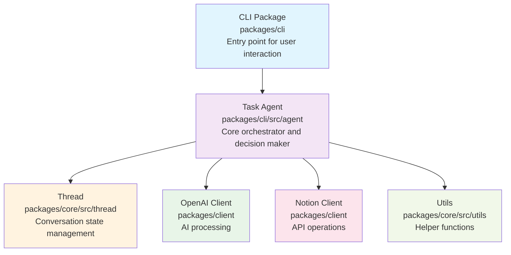
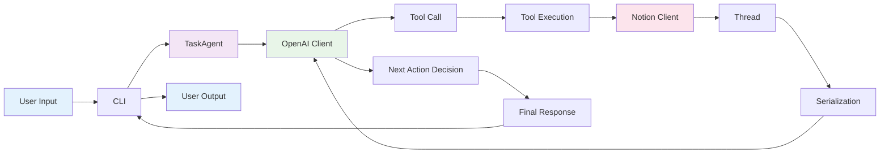
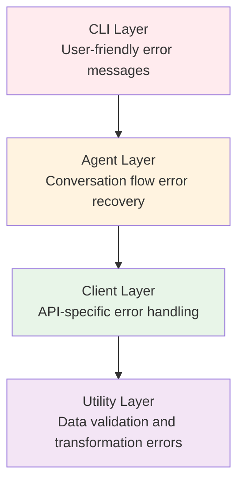

# Architecture Documentation

## Overview

Shochan AI is built as a conversational AI agent that bridges natural language requests with structured operations on external systems (Notion databases). The architecture follows clean separation of concerns with a focus on type safety, maintainability, and extensibility.

The project is structured as a **monorepo** using pnpm workspaces to enable code sharing and modular development.

## Monorepo Structure

```
shochan_ai/
├── packages/
│   ├── core/              # Business logic (zero dependencies)
│   │   ├── src/
│   │   │   ├── thread/    # Conversation state management
│   │   │   ├── types/     # Type definitions and guards
│   │   │   ├── utils/     # Utility functions
│   │   │   └── prompts/   # System prompts
│   │   └── package.json
│   │
│   ├── client/            # API clients (depends on core)
│   │   ├── src/
│   │   │   ├── openai.ts  # OpenAI client
│   │   │   └── notion.ts  # Notion client
│   │   └── package.json
│   │
│   └── cli/               # CLI implementation (depends on core + client)
│       ├── src/
│       │   ├── index.ts   # CLI entry point
│       │   └── agent/     # TaskAgent
│       └── package.json
│
├── pnpm-workspace.yaml    # Workspace configuration
├── tsconfig.base.json     # Shared TypeScript config
└── package.json           # Root package with scripts
```

**Dependency Graph:**
```
packages/core (no dependencies)
    ↑
packages/client (depends on @shochan_ai/core)
    ↑
packages/cli (depends on @shochan_ai/core + @shochan_ai/client)
```

## High-Level Architecture



## Core Components

### 1. CLI Interface (`packages/cli/src/index.ts`)

The command-line interface serves as the entry point for user interactions.

**Location:** `packages/cli/src/index.ts`

**Responsibilities:**
- Parse command-line arguments
- Initialize the TaskAgent with user input
- Handle conversational loops for multi-turn interactions
- Manage user input/output for interactive sessions
- Load environment variables from repository root

**Key Features:**
- Single-command execution mode
- Interactive conversation handling
- Graceful error handling and process management
- Shebang support for direct execution (`#!/usr/bin/env node`)

**Package Configuration:**
```json
{
  "name": "@shochan_ai/cli",
  "bin": {
    "shochan-ai": "./dist/index.js"
  },
  "dependencies": {
    "@shochan_ai/core": "workspace:*",
    "@shochan_ai/client": "workspace:*"
  }
}
```

### 2. Task Agent (`packages/cli/src/agent/task-agent.ts`)

The central orchestrator that implements the main agent loop and decision-making logic.

**Location:** `packages/cli/src/agent/task-agent.ts`

**Note:** TaskAgent is located in the CLI package as it represents application logic rather than core framework logic.

**Responsibilities:**
- Convert natural language to structured tool calls via Claude
- Execute tool calls against external systems
- Manage conversation flow and state transitions
- Determine when to request more information vs. provide final responses

**Agent Loop Flow:**
```
1. Determine Next Step (via OpenAI GPT-4o)
2. Add step to conversation thread
3. Execute tool if needed
4. Continue loop until done_for_now or request_more_information
```

**Supported Tools:**
- `get_tasks`: Retrieve tasks from Notion with filtering options
- `get_task_details`: Get detailed information about a specific task including page content
- `create_task`: Create new tasks in Notion GTD system
- `update_task`: Modify existing tasks (title, type, dates, project, status)
- `delete_task`: Remove tasks (requires human approval)
- `create_project`: Create new projects with importance levels
- `request_more_information`: Ask user for clarification
- `done_for_now`: Provide final response to user

### 3. Thread Management (`packages/core/src/thread/thread.ts`)

Manages conversation state and context serialization.

**Location:** `packages/core/src/thread/thread.ts`

**Package:** `@shochan_ai/core` (zero dependencies)

**Responsibilities:**
- Store conversation events in chronological order
- Serialize conversation context for AI model consumption
- Provide recursive object serialization for complex data structures
- Determine conversation state (awaiting response, approval, etc.)

**Event Structure:**
```typescript
interface Event {
  type: string;
  data: any;
}
```

**Serialization Features:**
- XML-based context serialization
- Recursive handling of nested objects and arrays
- Intelligent filtering of internal fields (e.g., 'intent')

### 4. External Clients

#### OpenAI Client (`packages/client/src/openai.ts`)

Handles integration with OpenAI's API via Responses API.

**Location:** `packages/client/src/openai.ts`

**Package:** `@shochan_ai/client` (depends on `@shochan_ai/core`)

**Responsibilities:**
- Generate structured function calls from natural language using GPT-4o
- Manage API communication with retry logic
- Handle rate limiting and error recovery

**Features:**
- OpenAI Responses API for server-side conversation management
- Automatic JSON parsing of function arguments
- Configurable retry mechanism (3 attempts with exponential backoff)
- Support for function calling with 8 tools
- Cost optimization via server-side conversation caching (`previous_response_id` and `store: true`)

**API Integration Details:**
- Uses `ResponseInput` with `instructions` (system prompt) and `previous_response_id` (conversation continuation)
- Function calls received via `response.output.function_call` structure
- Server-side conversation history management eliminates manual message array construction
- Retry logic handles 429 (rate limit) and 500-504 (server errors)

#### Notion Client (`packages/client/src/notion.ts`)

Manages all interactions with Notion databases.

**Location:** `packages/client/src/notion.ts`

**Package:** `@shochan_ai/client` (depends on `@shochan_ai/core`)

**Responsibilities:**
- CRUD operations on tasks and projects
- Database querying with filtering and sorting
- Data transformation between internal and Notion formats

**Supported Operations:**
- Task creation with GTD categorization
- Task retrieval with advanced filtering options
- Task detail retrieval including page content from Notion blocks
- Task updating (title, type, scheduled date, project assignment, archive status)
- Task deletion with archival
- Project creation with importance levels
- Proper error handling and validation

### 5. Type System (`packages/core/src/types/`)

Comprehensive type definitions ensuring type safety across the application.

**Location:** `packages/core/src/types/`

**Package:** `@shochan_ai/core` (zero dependencies)

**Key Type Categories:**
- **Tool Types**: Structured definitions for all supported tools
- **Notion Types**: Database schema and API response types  
- **Task Types**: GTD system task categorizations
- **Tool Guards**: Runtime type validation functions

**Type Safety Features:**
- Strict TypeScript configuration
- Runtime type validation
- Discriminated unions for tool calls
- Comprehensive error type definitions

### 6. Utilities (`packages/core/src/utils/`)

Supporting utilities for data processing and API interactions.

**Location:** `packages/core/src/utils/`

**Package:** `@shochan_ai/core` (zero dependencies)

**Components:**
- **Notion Query Builder**: Constructs complex database queries with filtering and sorting
- **Notion Task Parser**: Transforms Notion responses to internal format, includes block content parsing
- **Notion Utils**: Helper functions for API parameter construction and page updates

## Data Flow

### 1. Request Processing Flow



### 2. Conversation State Management

The system maintains conversation state through an event-driven model:

1. **User Input Events**: Capture user requests and responses
2. **Tool Call Events**: Record AI decisions and tool invocations  
3. **Tool Result Events**: Store external system responses
4. **System Events**: Track state transitions and errors

### 3. Context Serialization

The Thread component serializes conversation context into XML format for AI consumption:

```xml
<user_input>
今週のタスクを10件教えて
</user_input>

<get_tasks>
limit: 10
task_type: Today
</get_tasks>

<get_tasks_result>
tasks: [
  {title: "レポート作成", description: "月次レポートの作成"},
  {title: "会議準備", description: "プロジェクト会議の資料準備"}
]
</get_tasks_result>
```

## Design Patterns

### 1. Agent Pattern

The TaskAgent implements a classical agent pattern with:
- **Perception**: Natural language understanding via OpenAI GPT-4o
- **Decision Making**: Tool selection and parameter determination
- **Action**: Tool execution against external systems
- **Learning**: Conversation context accumulation

### 2. Command Pattern

Tool calls implement the command pattern:
- **Command Interface**: ToolCall with intent and parameters
- **Concrete Commands**: CreateTaskTool, GetTasksTool, GetTaskDetailsTool, UpdateTaskTool, DeleteTaskTool, etc.
- **Invoker**: TaskAgent orchestrates execution
- **Receiver**: Notion Client executes actual operations

### 3. Strategy Pattern

The system uses strategy pattern for:
- **Tool Execution Strategies**: Different handling for different tool types
- **Serialization Strategies**: Various data transformation approaches
- **Error Handling Strategies**: Context-specific error recovery

## Configuration Management

### Environment Variables

```env
OPENAI_API_KEY             # OpenAI API access
NOTION_API_KEY             # Notion integration token
NOTION_TASKS_DATABASE_ID   # Tasks database identifier
NOTION_PROJECTS_DATABASE_ID # Projects database identifier
```

### System Configuration

- **OpenAI Model**: gpt-4o (GPT-4 Optimized)
- **Max Tokens**: 1024 for function call generation
- **Retry Policy**: 3 attempts with exponential backoff
- **Default Limits**: 10 tasks per query, configurable up to 100
- **API Type**: OpenAI Responses API with server-side conversation storage

## Error Handling Strategy

### 1. Layered Error Handling



### 2. Error Types

- **Configuration Errors**: Missing environment variables
- **API Errors**: External service failures with retry logic
- **Validation Errors**: Invalid tool parameters or data structures
- **Business Logic Errors**: GTD system constraint violations

### 3. Recovery Mechanisms

- **Automatic Retry**: For transient API failures
- **Graceful Degradation**: Partial functionality when services are limited
- **User Feedback**: Clear error messages with suggested actions
- **Conversation Recovery**: Ability to continue after errors

## Performance Considerations

### 1. API Optimization

- **Request Batching**: Minimize API calls where possible
- **Caching Strategy**: No persistent caching (stateless design)
- **Rate Limiting**: Built-in retry logic respects API limits

### 2. Memory Management

- **Conversation History**: Grows linearly with interaction length
- **Object Serialization**: Recursive but bounded by conversation depth
- **Event Storage**: In-memory only, no persistent storage

### 3. Scalability Factors

- **Stateless Design**: Each CLI invocation is independent
- **Single User Model**: Designed for individual task management
- **Resource Usage**: Bounded by conversation length and tool complexity

## Security Considerations

### 1. API Key Management

- Environment variable storage only
- No key logging or persistence
- Secure client initialization patterns

### 2. Data Privacy

- No persistent storage of conversation data
- Notion data access limited to configured databases
- User data never logged or transmitted beyond necessary APIs

### 3. Input Validation

- Comprehensive type checking at API boundaries
- Runtime validation of tool parameters
- Sanitization of user inputs before external API calls

## Testing Strategy

### 1. Unit Testing

- Individual component testing with Vitest
- Mock external dependencies (OpenAI, Notion APIs)
- Type guard validation testing
- Utility function testing

### 2. Integration Testing

- End-to-end CLI testing scenarios
- API client integration verification
- Error handling pathway testing

### 3. Type Testing

- TypeScript strict mode enforcement
- Runtime type validation testing
- Tool call structure validation

## Deployment & Operations

### 1. Build Process

**Monorepo Build Commands:**
```bash
# Build all packages
pnpm build          # Builds packages/core, packages/client, packages/cli

# Build specific package
pnpm --filter @shochan_ai/core build
pnpm --filter @shochan_ai/client build
pnpm --filter @shochan_ai/cli build

# Run CLI
pnpm cli "your message here"

# Testing
pnpm test           # Run all tests (vitest)
pnpm test:watch     # Watch mode

# Code Quality
pnpm check          # Biome linting and formatting
pnpm check:fix      # Auto-fix issues
```

**Build Order:**
TypeScript project references ensure correct build order:
1. `packages/core` (no dependencies)
2. `packages/client` (depends on core)
3. `packages/cli` (depends on core + client)

### 2. Runtime Requirements

- Node.js 18+ environment
- pnpm 8+ (for workspace support)
- Environment variable configuration (`.env` in repository root)
- Network access to OpenAI and Notion APIs

**Environment Variables:**
The CLI automatically loads `.env` from the repository root:
```typescript
// packages/cli/src/index.ts
dotenv.config({ path: path.resolve(__dirname, '../../..', '.env') });
```

### 3. Monitoring

- Console-based logging for development
- Error tracking through CLI exit codes
- No persistent metrics or monitoring (CLI tool design)

## Future Extensibility

### 1. New Tool Integration

The architecture supports easy addition of new tools as demonstrated by the recent `get_task_details` implementation:

1. Define tool interface in `packages/core/src/types/tools.ts`
2. Add type guard function in `packages/core/src/types/toolGuards.ts`
3. Add tool definition to TaskAgent tool list in system prompt
4. Implement tool execution in `packages/cli/src/agent/task-agent.ts`
5. Add corresponding method in `packages/client/src/notion.ts`
6. Update system prompt documentation

### 2. Additional Clients

New external service integration follows the pattern:

1. Create client class in `packages/client/src/`
2. Define service-specific types in `packages/core/src/types/`
3. Add to TaskAgent dependency injection
4. Implement error handling and retry logic

### 3. Enhanced Conversation Management

The Thread system can be extended for:

- Persistent conversation storage
- Multi-session conversation tracking
- Advanced context management strategies
- Conversation branching and merging

## Conclusion

Shochan AI's architecture prioritizes simplicity, type safety, and maintainability while providing a robust foundation for natural language task management. The monorepo structure enables code sharing and modular development, while maintaining clean separation of concerns and comprehensive error handling suitable for both development and production use cases.