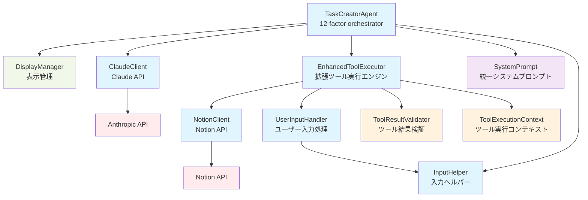
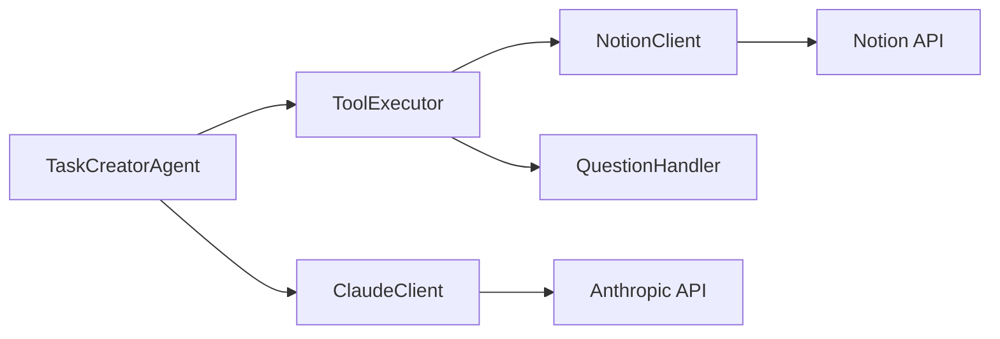
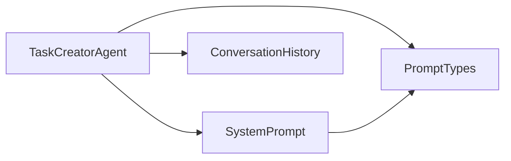
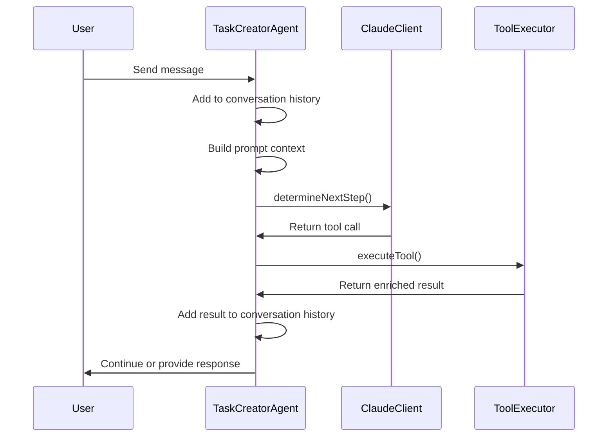
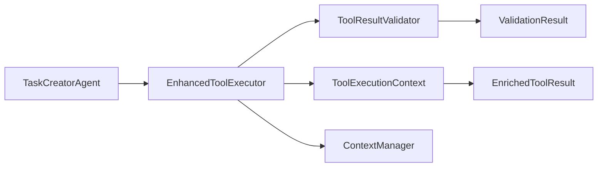

# 🏗️ Architecture Documentation

This document describes the architecture of the Shochan AI Agent, implemented following the [12-factor agents](https://github.com/humanlayer/12-factor-agents) principles.

## 📊 Architecture



## 🎯 Layered Architecture

### **Agent Layer**
- **TaskCreatorAgent**: Main orchestrator implementing 12-factor pattern with `determineNextStep()` and `executeTool()` methods

### **Conversation Management Layer**
- **DisplayManager**: Centralized display and logging functionality
- **InputHelper**: Unified input handling to prevent character duplication issues

### **Service Layer**
- **EnhancedToolExecutor** (Factor 4): Enhanced tool execution with validation and context
- **SystemPrompt** (Factor 2): Unified prompt generation using conversation history

### **Client Layer**
- **ClaudeClient**: Anthropic Claude API integration
- **NotionClient**: Notion API integration for GTD system
- **QuestionHandler**: Interactive user questioning


## 📚 Factor-by-Factor Implementation

### **Factor 1: Natural Language to Tool Calls** ✅

**Purpose**: Convert natural language input into structured tool calls



**Components**:
- `ClaudeClient`: Handles LLM API communication
- `ToolExecutor`: Manages tool execution lifecycle
- `NotionClient`: Creates tasks and projects in Notion
- `QuestionHandler`: Interactive user questioning

### **Factor 2: Own Your Prompts** ✅

**Purpose**: Unified system prompt generation using conversation context



**Components**:
- `SystemPrompt`: Single unified prompt function (`buildSystemPrompt()`)
- `PromptTypes`: Type-safe prompt context with conversation history
- Direct conversation history usage instead of complex categorization

**Key Features**:
- **Simplified prompt management**: Single function handles all cases
- **Context-aware prompts**: Uses full conversation history for LLM decision making
- **No phase-specific prompts**: LLM determines appropriate response based on context

### **Factor 3: Own Your Context Window** ✅

**Purpose**: Direct conversation history management using standard format

```mermaid
graph LR
    A[TaskCreatorAgent] --> B[ConversationHistory]
    B --> C[Anthropic.MessageParam[]]
    A --> C
```

**Components**:
- `ConversationHistory`: Simple array of `Anthropic.MessageParam[]`
- Direct context passing to LLM without complex optimization
- Standard OpenAI/Anthropic conversation format

**Key Features**:
- **Standard format**: Uses `Anthropic.MessageParam[]` directly
- **Simple context management**: No token counting or prioritization overhead
- **LLM-driven context usage**: Let the LLM handle context optimization internally
- **Real-time Statistics**: Context window utilization tracking

## 🔄 Architecture Simplification

### **Clean Architecture Evolution**
The TaskCreatorAgent has been simplified following 12-factor agents principles:

**Evolution Path:**
1. **Complex multi-component architecture** with ContextManager, PromptManager, ConversationManager
2. **Simplified unified approach** using direct conversation history and single system prompt
3. **12-factor pattern implementation** with clear `determineNextStep()` and `executeTool()` separation

**Current Architecture:**
- **TaskCreatorAgent**: Main orchestrator following 12-factor pattern
- **DisplayManager**: Centralized display and logging
- **InputHelper**: Unified input handling (singleton pattern)
- **Direct conversation history**: `Anthropic.MessageParam[]` array

### **Benefits Achieved:**
- **Reduced Complexity**: Removed ~500+ lines of abstraction code
- **Better LLM Integration**: Direct conversation history usage
- **Improved Maintainability**: Fewer components to manage
- **Standard Format**: Compatible with OpenAI/Anthropic best practices

## 🎨 Design Patterns

### **1. 12-Factor Pattern**
```typescript
// Step 1: Determine next step using LLM
const nextStep = await this.determineNextStep(promptContext, userMessage, optimizedHistory);

// Step 2: Execute the determined tool
return await this.executeTool(nextStep);
```

### **2. Simplified Dependency Injection**
```typescript
constructor() {
  this.claude = new ClaudeClient();
  this.toolExecutor = new EnhancedToolExecutor();
  this.displayManager = new DisplayManager();
  // Simplified: Direct conversation history management
}
```

### **3. Type Guards for Runtime Safety**
```typescript
if (isCreateTaskTool(toolCall)) {
  // Type-safe tool execution
}
```

### **4. Unified System Prompt**
```typescript
// Single prompt function handles all cases
const systemPrompt = buildSystemPrompt({
  userMessage,
  conversationHistory: this.conversationHistory,
});
```

## 📁 Simplified File Structure

```
src/
├── agents/
│   └── task-creator.ts           # Main orchestrator agent with 12-factor pattern
├── clients/
│   ├── claude.ts                 # Anthropic Claude API client
│   └── notion.ts                 # Notion API client
├── conversation/
│   └── display-manager.ts        # Centralized display and logging functionality
├── prompts/
│   └── system-prompt.ts          # Unified system prompt management
├── tools/                        # Factor 1 & 4: Tool System
│   ├── index.ts                  # Legacy tool execution engine
│   ├── enhanced-tool-executor.ts # Enhanced execution with validation
│   ├── tool-execution-context.ts # Execution context management
│   ├── tool-result-validator.ts  # Input/output validation
│   └── user-input-handler.ts     # User input handling
├── types/
│   ├── conversation-types.ts     # Conversation-related types
│   ├── notion.ts                 # Notion API types
│   ├── prompt-types.ts           # Prompt system types
│   ├── tools.ts                  # Tool system types
│   └── toolGuards.ts            # Runtime type validation
├── utils/
│   ├── input-helper.ts           # Unified input handling
│   └── notionUtils.ts           # Notion utility functions
├── interactive.ts               # Interactive mode entry point
└── test-*.ts                    # Various test scenarios
```

## 🔄 Data Flow

### **1. 12-Factor Message Processing Flow**


## 🚀 Performance Benefits

### **Simplified Architecture Benefits**
- **Reduced complexity**: ~500+ lines of code removed
- **Better LLM integration**: Direct conversation history usage
- **Standard format**: Compatible with OpenAI/Anthropic best practices
- **Easier maintenance**: Fewer components to manage and debug

### **Memory Efficiency**
- Direct `Anthropic.MessageParam[]` usage
- No complex context optimization overhead
- Standard conversation format reduces conversion complexity

### **Factor 4: Tools are Just Structured Outputs** ✅

**Purpose**: Enhanced tool execution with structured outputs, validation, and monitoring



**Components**:
- `EnhancedToolExecutor`: Decorator pattern over legacy ToolExecutor
- `ToolResultValidator`: Type-safe input/output validation
- `ToolExecutionContext`: Rich execution context with tracing
- `EnrichedToolResult`: Structured results with metadata

**Key Features**:
- **Tool-specific timeouts**: ask_question (10min), API calls (30s)
- **Input/Output validation**: Type guards without `as` casting
- **Distributed tracing**: TraceID for multi-tool conversations
- **Performance monitoring**: Execution time, retry counts, statistics
- **Error handling**: Structured errors with suggested actions

## 🔮 Future Architecture (Factors 5-12)

### **Next Priorities**
1. **Factor 5**: Unify Execution State with Business State
2. **Factor 6**: Agent Interaction APIs
3. **Factor 7**: Agents are Async Everywhere

### **Planned Architectural Enhancements**
- **Microservices Architecture**: Small, focused agents (Factor 10)
- **Event-Driven Design**: Triggerable from anywhere (Factor 11)
- **Stateless Reducers**: Pure function-based agents (Factor 12)

## 🛠️ Development Guidelines

### **Adding New Factors**
1. Create dedicated directory under `src/`
2. Define types in `src/types/`
3. Implement core logic with dependency injection
4. Integrate with `TaskCreatorAgent`
5. Add tests and documentation

### **Type Safety**
- Use strict TypeScript configuration
- Implement runtime type guards
- Define clear interfaces for all components

### **Testing Strategy**
- Unit tests for individual components
- Integration tests for factor combinations
- Interactive tests for user experience validation

---

This architecture demonstrates the progressive implementation of 12-factor agents principles, creating a robust, scalable, and maintainable AI agent system.