# 🏗️ Architecture Documentation

This document describes the architecture of the Shochan AI Agent, implemented following the [12-factor agents](https://github.com/humanlayer/12-factor-agents) principles.

## 📊 Architecture

```mermaid
graph TB
    %% Main Agent
    Agent[TaskCreatorAgent<br/>12-factor orchestrator]
    
    %% Core Components
    DisplayMgr[DisplayManager<br/>表示管理]
    Claude[ClaudeClient<br/>Claude API]
    ToolExec[EnhancedToolExecutor<br/>拡張ツール実行エンジン]
    Notion[NotionClient<br/>Notion API]
    UserInputHandler[UserInputHandler<br/>ユーザー入力処理]
    InputHelper[InputHelper<br/>入力ヘルパー]
    
    %% Factor 2: Simplified Prompt Management
    SystemPrompt[SystemPrompt<br/>統一システムプロンプト]
    
    %% Factor 4: Tool Enhancement Components
    ToolValidator[ToolResultValidator<br/>ツール結果検証]
    ToolContext[ToolExecutionContext<br/>ツール実行コンテキスト]
    
    %% External APIs
    AnthropicAPI[Anthropic API]
    NotionAPI[Notion API]
    
    %% Simplified Dependencies
    Agent --> DisplayMgr
    Agent --> Claude
    Agent --> ToolExec
    Agent --> SystemPrompt
    Agent --> InputHelper
    
    %% Tool execution flow
    Claude --> AnthropicAPI
    ToolExec --> Notion
    ToolExec --> UserInputHandler
    ToolExec --> ToolValidator
    ToolExec --> ToolContext
    Notion --> NotionAPI
    UserInputHandler --> InputHelper
    
    %% Styling
    classDef factor1 fill:#e1f5fe
    classDef factor2 fill:#f3e5f5
    classDef factor4 fill:#fff3e0
    classDef conversation fill:#f1f8e9
    classDef external fill:#ffebee
    
    class Agent,Claude,ToolExec,Notion,UserInputHandler,InputHelper factor1
    class SystemPrompt factor2
    class ToolValidator,ToolContext factor4
    class DisplayMgr conversation
    class AnthropicAPI,NotionAPI external
```



## 🎯 Layered Architecture

### **Agent Layer**
- **TaskCreatorAgent**: Main orchestrator implementing 12-factor pattern with `determineNextStep()` and `executeTool()` methods

### **Conversation Management Layer**
- **DisplayManager**: Centralized display and logging functionality
- **InputHelper**: Unified input handling to prevent character duplication issues

### **Service Layer**
- **EnhancedToolExecutor** (Factor 4): Enhanced tool execution with validation and context
- **SystemPrompt** (Factor 2): Unified prompt generation using conversation history

### **Client Layer**
- **ClaudeClient**: Anthropic Claude API integration
- **NotionClient**: Notion API integration for GTD system
- **QuestionHandler**: Interactive user questioning


## 📚 Factor-by-Factor Implementation

### **Factor 1: Natural Language to Tool Calls** ✅

**Purpose**: Convert natural language input into structured tool calls


**Components**:
- `ClaudeClient`: Handles LLM API communication
- `ToolExecutor`: Manages tool execution lifecycle
- `NotionClient`: Creates tasks and projects in Notion
- `QuestionHandler`: Interactive user questioning

### **Factor 2: Own Your Prompts** ✅

**Purpose**: Unified system prompt generation using conversation context


**Components**:
- `SystemPrompt`: Single unified prompt function (`buildSystemPrompt()`)
- `PromptTypes`: Type-safe prompt context with conversation history
- Direct conversation history usage instead of complex categorization

**Key Features**:
- **Simplified prompt management**: Single function handles all cases
- **Context-aware prompts**: Uses full conversation history for LLM decision making
- **No phase-specific prompts**: LLM determines appropriate response based on context

### **Factor 3: Own Your Context Window** ✅

**Purpose**: XML-based context management with event-driven Thread model

```mermaid
graph LR
    A[TaskCreatorAgent] --> B[ContextManager]
    B --> C[Thread]
    C --> D[Event[]]
    D --> E[XML+YAML Context]
    A --> E
```

**Components**:
- `ContextManager`: XML-based context management with Thread model
- `Thread`: Event-driven conversation flow with XML serialization
- `Event`: Type-safe event data structures with YAML-in-XML formatting
- `YamlUtils`: YAML formatting utilities for structured data presentation

**Key Features**:
- **XML+YAML format**: Structured conversation context with full event tracking
- **Event-driven architecture**: Complete audit trail of all tool executions
- **Enhanced debugging**: Full conversation state visibility for developers
- **Type-safe events**: Comprehensive event type system with proper validation
- **Zero legacy dependencies**: Clean XML-only implementation

**XML Context Example:**
```xml
<conversation_context>
<session_info>
thread_id: "thread_1724398500_abc123"
start_time: "2025-08-23T10:35:00Z"
event_count: 5
</session_info>

<user_message>
message: "新しいプロジェクトを作成したい"
timestamp: "2025-08-23T10:35:00Z"
</user_message>

<create_project>
name: "AI研究プロジェクト"
description: "機械学習の研究を行うプロジェクト"
importance: "⭐⭐⭐⭐"
</create_project>

<create_project_result>
success: true
project_id: "proj_456"
notion_url: "https://notion.so/proj_456"
execution_time: 1200
</create_project_result>
</conversation_context>
```

## 🔄 Architecture Evolution

### **XML-Based Context Transformation**
The TaskCreatorAgent has evolved to implement advanced 12-factor agents principles:

**Evolution Path:**
1. **Legacy MessageParam[] approach** with fragmented context information
2. **Dual-mode transition** supporting both legacy and XML-based context
3. **Complete XML migration** with event-driven Thread model
4. **Production-ready system** with enhanced debugging and monitoring

**Current Architecture:**
- **TaskCreatorAgent**: Main orchestrator with XML context integration
- **ContextManager**: Event-driven Thread model with XML serialization
- **Event System**: Complete tool execution tracking and conversation audit trail
- **DisplayManager**: Enhanced logging with event statistics
- **InputHelper**: Unified input handling (singleton pattern)

### **Benefits Achieved:**
- **Enhanced Visibility**: Complete conversation state visible in structured XML
- **Better Debugging**: Full event audit trail for all tool executions
- **Improved LLM Understanding**: Structured context with YAML-in-XML format
- **Zero Legacy Dependencies**: Clean XML-only implementation
- **Production Monitoring**: Event-driven statistics and performance tracking

## 🎨 Design Patterns

### **1. 12-Factor Pattern**
```typescript
// Step 1: Determine next step using LLM
const nextStep = await this.determineNextStep(promptContext, userMessage, optimizedHistory);

// Step 2: Execute the determined tool
return await this.executeTool(nextStep);
```

### **2. XML-Based Dependency Injection**
```typescript
constructor() {
  this.claude = new ClaudeClient();
  this.toolExecutor = new EnhancedToolExecutor();
  this.contextManager = new ContextManager(); // XML-based context with Thread model
  this.displayManager = new DisplayManager();
}
```

### **3. Type Guards for Runtime Safety**
```typescript
if (isCreateTaskTool(toolCall)) {
  // Type-safe tool execution
}
```

### **4. XML Context-Aware System Prompt**
```typescript
// XML context via Thread model
const promptContext = this.contextManager.buildPromptContext(userMessage);
const systemPrompt = buildSystemPrompt(promptContext);
// Context includes structured XML with complete event history
```

## 📁 XML-Enhanced File Structure

```
src/
├── agents/
│   └── task-creator.ts           # Main orchestrator agent with XML context integration
├── clients/
│   ├── claude.ts                 # Anthropic Claude API client
│   └── notion.ts                 # Notion API client
├── conversation/
│   ├── context-manager.ts        # XML-based context management with Thread model
│   └── display-manager.ts        # Enhanced logging with event statistics
├── events/                       # Factor 3: XML Context System
│   ├── types.ts                  # Event type definitions and data structures
│   ├── thread.ts                 # Event/Thread classes with XML serialization
│   ├── yaml-utils.ts             # YAML-in-XML formatting utilities
│   └── *.test.ts                 # Comprehensive event system test suites
├── prompts/
│   └── system-prompt.ts          # XML context-aware prompt management
├── tools/                        # Factor 1 & 4: Enhanced Tool System
│   ├── index.ts                  # Legacy tool execution engine
│   ├── enhanced-tool-executor.ts # XML event recording with validation
│   ├── tool-execution-context.ts # Execution context management
│   ├── tool-result-validator.ts  # Input/output validation
│   └── user-input-handler.ts     # User input handling
├── types/
│   ├── conversation-types.ts     # Conversation-related types
│   ├── notion.ts                 # Notion API types
│   ├── prompt-types.ts           # XML-aware prompt system types
│   ├── tools.ts                  # Tool system types
│   └── toolGuards.ts            # Runtime type validation
├── utils/
│   ├── input-helper.ts           # Unified input handling
│   └── notionUtils.ts           # Notion utility functions
├── interactive.ts               # Interactive mode entry point
└── test-*.ts                    # Various test scenarios
```

## 🔄 Data Flow

### **1. 12-Factor Message Processing Flow**


## 🚀 Performance Benefits

### **Simplified Architecture Benefits**
- **Reduced complexity**: ~500+ lines of code removed
- **Better LLM integration**: Direct conversation history usage
- **Standard format**: Compatible with OpenAI/Anthropic best practices
- **Easier maintenance**: Fewer components to manage and debug

### **Memory Efficiency**
- Event-driven Thread model with efficient XML serialization
- Structured data storage with YAML-in-XML format
- Enhanced debugging capabilities without performance overhead
- Complete event audit trail with minimal memory footprint

### **Factor 4: Tools are Just Structured Outputs** ✅

**Purpose**: Enhanced tool execution with XML event recording, validation, and monitoring


**Components**:
- `EnhancedToolExecutor`: Enhanced execution with XML event recording
- `ToolResultValidator`: Type-safe input/output validation
- `ToolExecutionContext`: Rich execution context with tracing
- `EnrichedToolResult`: Structured results with metadata
- `Event System`: Complete audit trail in XML+YAML format

**Key Features**:
- **XML Event Recording**: All tool executions recorded as structured events
- **Tool-specific timeouts**: ask_question (10min), API calls (30s)
- **Input/Output validation**: Type guards without `as` casting
- **Distributed tracing**: TraceID for multi-tool conversations
- **Performance monitoring**: Execution time, retry counts, statistics
- **Complete Audit Trail**: Every tool execution and result tracked in XML context
- **Error handling**: Structured errors with suggested actions

## 🔮 Future Architecture (Factors 5-12)

### **Next Priorities**
1. **Factor 5**: Unify Execution State with Business State
2. **Factor 6**: Agent Interaction APIs
3. **Factor 7**: Agents are Async Everywhere
4. **Enhanced Monitoring**: Production-ready observability and metrics

### **Planned Architectural Enhancements**
- **Microservices Architecture**: Small, focused agents (Factor 10)
- **Event-Driven Design**: Triggerable from anywhere (Factor 11)
- **Stateless Reducers**: Pure function-based agents (Factor 12)

## 🛠️ Development Guidelines

### **Adding New Factors**
1. Create dedicated directory under `src/`
2. Define types in `src/types/`
3. Implement core logic with dependency injection
4. Integrate with `TaskCreatorAgent`
5. Add tests and documentation

### **Type Safety**
- Use strict TypeScript configuration
- Implement runtime type guards
- Define clear interfaces for all components

### **Testing Strategy**
- Unit tests for individual components
- Integration tests for factor combinations
- Interactive tests for user experience validation

---

This architecture demonstrates the advanced implementation of 12-factor agents principles with XML-based context management, creating a robust, scalable, and maintainable AI agent system with complete conversation visibility and event-driven audit trails.